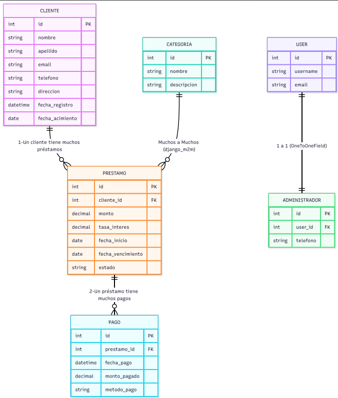
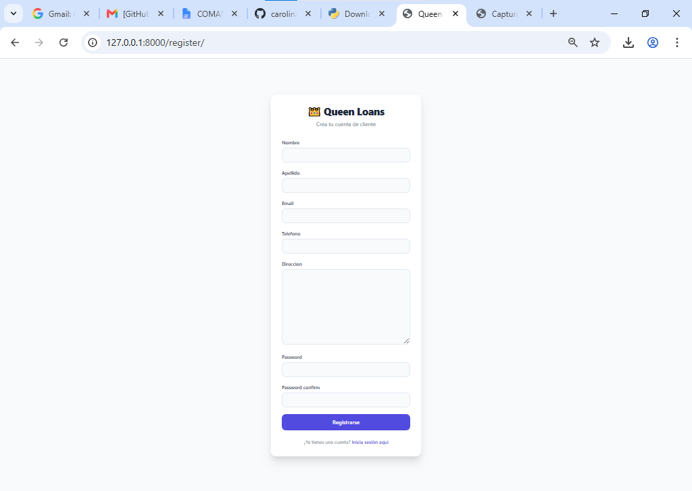
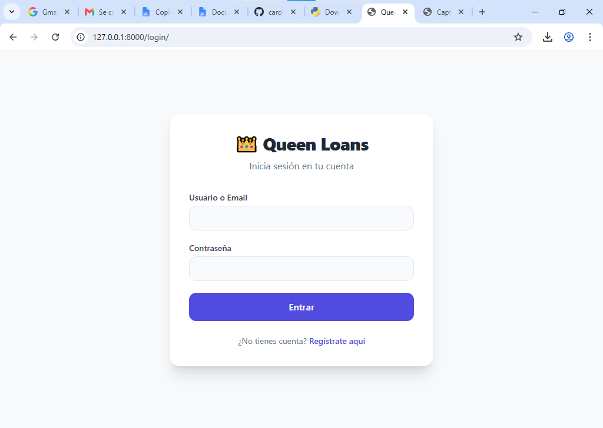
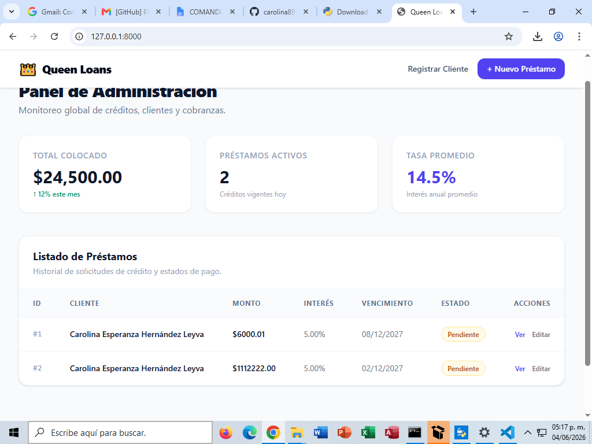
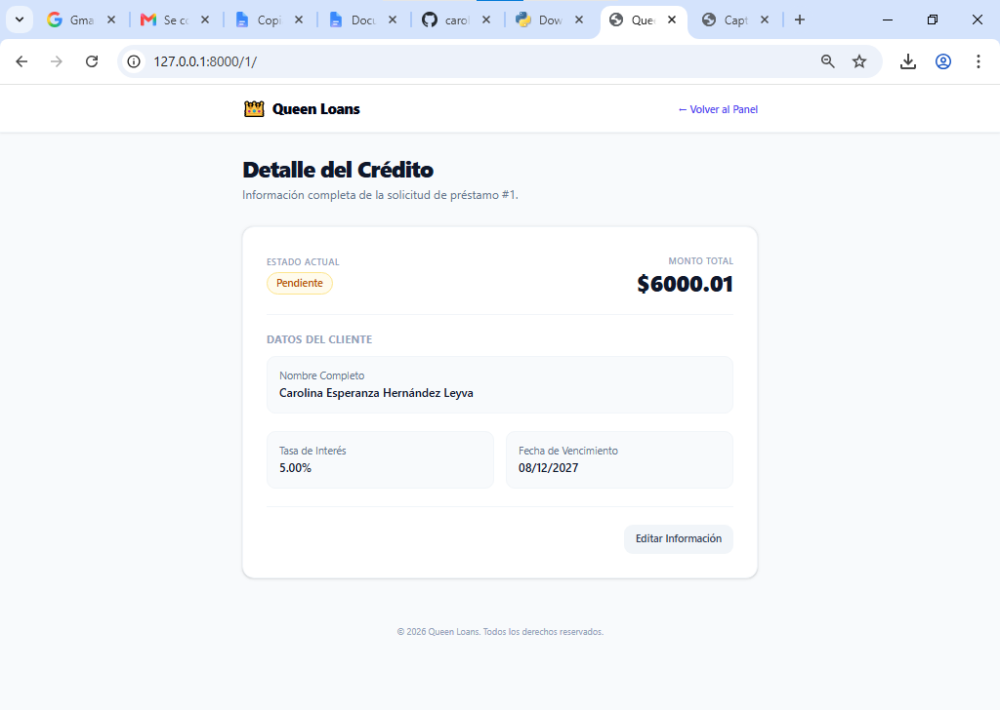

# Queen_Loans 👑

Aplicación web de gestión de préstamos desarrollada con **Django**, **Python** y **HTML**.

## EQUIPO 2

HERNANDEZ LEYVA CAROLINA ESPERANZA 
AGUIRRE ANGIE VANESSA
REBOLLAR CASTELLANOS BRENDA LIZETH
LOPEZ RITCHIE OMAR ISAIAS
HERNANDEZ GALLARDO MARGARITA CONCEPCION
CASTRO LAZARO MARIA FERNANDA

## 📋 Descripción

**Queen_Loans** permite a los clientes solicitar préstamos y a los administradores gestionar préstamos, pagos y categorías de manera eficiente.

## INTRODUCCIÓN

En este proyecto desarrollamos QueenLoans, una aplicación web financiera hecha para administrar clientes, préstamos y pagos de una forma más fácil y organizada. La idea fue crear un sistema que ayudará a guardar la información de los clientes, registrar préstamos y controlar los pagos sin tener que hacer todo manualmente o entre muchos papeles.
Para realizar el proyecto utilizamos Django, un framework de Python que nos ayudó a acomodar mejor el código y entender más cómo funciona una aplicación web real. También usamos SQLite para guardar toda la información de la base de datos de manera sencilla y ordenada.
Durante el desarrollo creamos varios modelos como Cliente, Préstamo, Pago y Administrador, donde cada uno tiene una función diferente dentro del sistema. También agregamos funciones importantes como registrar usuarios, validar que sean mayores de edad, crear préstamos, editarlos, eliminarlos y registrar pagos. Además usamos el panel de administración de Django para manejar toda la información más fácilmente.
Igualmente trabajamos con views, URLs y templates para conectar cada parte del sistema y hacer que las páginas funcionaran correctamente. Gracias a eso, cuando un usuario entra a una ruta, el sistema puede mostrar formularios, guardar datos y enseñar la información necesaria.
Aunque a veces nos confundimos, nos atoramos en varias cosas y hubo momentos donde pensamos que el proyecto no iba a funcionar, poco a poco logramos terminarlo entre todos. Este trabajo nos ayudó a aprender más sobre programación, bases de datos y cómo trabajar en equipo, además de entender mejor cómo se desarrolla una aplicación web desde cero.

## DESARROLLO
Para el desarrollo del proyecto se utilizó Django, un framework de Python que permite trabajar de manera organizada utilizando modelos, vistas y URLs, el sistema fue creado para administrar clientes, préstamos y pagos

### Modelos
En el archivo models.py se crearon cuatro modelos: Cliente, Préstamo, Pago y Administrador.
El modelo Cliente guarda información básica como nombre, correo, teléfono y dirección.
class Cliente(models.Model):
    nombre = models.CharField(max_length=100)
    apellido = models.CharField(max_length=100)
    email = models.EmailField(unique=True)
    telefono = models.CharField(max_length=15, blank=True, null=True)
    direccion = models.TextField(blank=True, null=True)
    fecha_registro = models.DateTimeField(default=timezone.now)
    fecha_nacimiento = models.DateField(null=True, blank=True)


    def __str__(self):
        return f"{self.nombre} {self.apellido}"

El modelo Préstamo almacena los préstamos realizados por cada cliente. Se utilizó una relación ForeignKey para indicar que un cliente puede tener varios préstamos.
cliente = models.ForeignKey(Cliente, on_delete=models.CASCADE)

También se agregaron datos como monto, tasa de interés y estado del préstamo.
El modelo Pago registra los pagos realizados para cada préstamo.
prestamo = models.ForeignKey(Prestamo, on_delete=models.CASCADE)

Esto significa que un préstamo puede tener varios pagos asociados.
Finalmente, el modelo Administrador se relaciona con los usuarios de Django mediante un OneToOneField.

### Base de Datos
La base de datos se organizó usando las  relaciones entre tablas.
1-Un cliente puede tener muchos préstamos.
2-Un préstamo puede tener muchos pagos.
3-Cada administrador tiene un usuario único.

### Administrador
Con el panel de administración de Django se pueden crear, editar y eliminar registros.
Desde el admin es posible:
1-Registrar clientes
2-Agregar préstamos
3-Registrar pagos
4-Actualizar información
5-Eliminar datos
Además se utilizó:
on_delete=models.CASCADE

para que al eliminar un cliente también se eliminen sus préstamos y pagos relacionados.

### Views
Las views contienen la lógica del sistema.
La vista principal del proyecto es registrar_usuario, la cual permite registrar usuarios y validar que sean mayores de edad antes de guardar la información.
if edad < 18:

También se crearon vistas para:
1-mostrar préstamos
2-crear préstamos
3-editar préstamos
4-eliminar préstamos

### URLs
En urls.py definimos  las rutas del sistema.
path("create/", views.loan_create, name="loan_create")

Cada URL se conecta con una view específica, cuando el usuario entra a una ruta, Django ejecuta la vista correspondiente.
### Templates 
El funcionamiento del sistema sigue este proceso:
Primero el usuario entra a una URL, luego Django ejecuta una view, la view trabaja con los modelos y finalmente se muestra un template HTML al usuario.
Por ejemplo:
return render(request, 'login.html')

Esto permite mostrar formularios.

### Configuración del Proyecto
En settings.py se configuró el proyecto y se registró la aplicación loans.
INSTALLED_APPS = [
    'loans',
]


## 🎯 Características

- ✅ Gestión de clientes
- ✅ Solicitud y seguimiento de préstamos
- ✅ Registro de pagos
- ✅ Categorización de préstamos
- ✅ Panel de administrador personalizado

## 📊 Modelos y Relaciones

### Modelos Implementados

1. **Cliente** - Información personal de clientes
2. **Préstamo** - Solicitudes de préstamo
3. **Pago** - Registro de pagos realizados
4. **Categoría** - Tipos/categorías de préstamos
5. **Administrador** - Usuarios administradores del sistema

### Relaciones de Base de Datos
**Relaciones:**
- **Cliente → Préstamo**: Uno a Muchos (1:N)
- **Préstamo → Pago**: Uno a Muchos (1:N)
- **Préstamo ↔ Categoría**: Muchos a Muchos (M:M)
- **Administrador → Usuario**: Uno a Uno (1:1)

## 🗂️ Estructura

```
Queen_Loans/
├── Queen_Loans/
│   ├── loans/
│   │   ├── migrations/
│   │   ├── models.py           # 5 modelos principales
│   │   ├── views.py            # Vistas de la aplicación
│   │   ├── urls.py             # Rutas
│   │   ├── forms.py            # Formularios
│   │   ├── admin.py            # Panel administrativo
│   │   └── tests.py
│   ├── Queen_Loans/
│   │   ├── settings.py
│   │   ├── urls.py
│   │   ├── wsgi.py
│   │   └── asgi.py
│   ├── templates/
│   ├── manage.py
│   └── db.sqlite3
├── README.md
├── requirements.txt
└── .gitignore
```


## 🚀 Instalación

### Requisitos
- Python
- pillow
- django

### Pasos

```bash
# Clonar repositorio
git clone https://github.com/carolina899/Queen_Loans.git
cd Queen_Loans

# Crear entorno virtual
python -m venv venv
Windows: venv\Scripts\activate

# Instalar dependencias
pip install django==5.2 pillow

# Aplicar migraciones
python manage.py migrate

# Crear superusuario
python manage.py createsuperuser

# Ejecutar servidor
python manage.py runserver
```

## 🌐 Acceso

- **Aplicación**: http://localhost:8000/
- **Admin**: http://localhost:8000/admin/

## 📚 Tecnologías

| Tecnología | Versión |
|-----------|---------|
| Django | 5.2+ |
| Python | 3.8+ |
| SQLite | - |
| HTML | 5 |
| CSS | 3 |
## App 








## 🔐 Funcionalidades del Admin


- **CRUD de Clientes**: Crear, ver, editar y eliminar clientes
- **CRUD de Préstamos**: Gestionar préstamos y sus categorías
- **CRUD de Pagos**: Registrar y visualizar pagos
- **CRUD de Categorías**: Crear y gestionar categorías de préstamos
- **Filtros avanzados**: Buscar por estado, fecha, cliente, etc.
- **Visualización de relaciones**: Ver préstamos por cliente, pagos por préstamo, categorías asignadas


GitHub: [@carolina899](https://github.com/carolina899)

